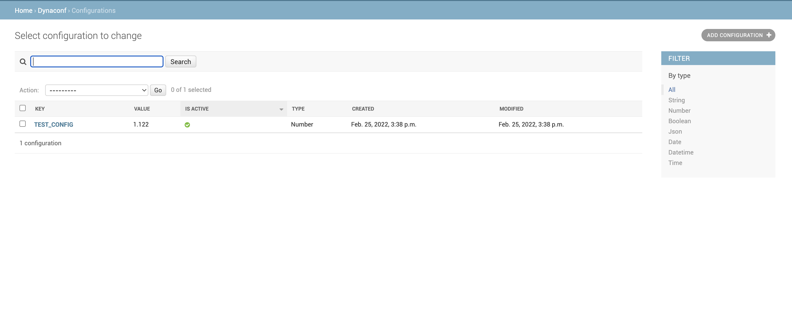
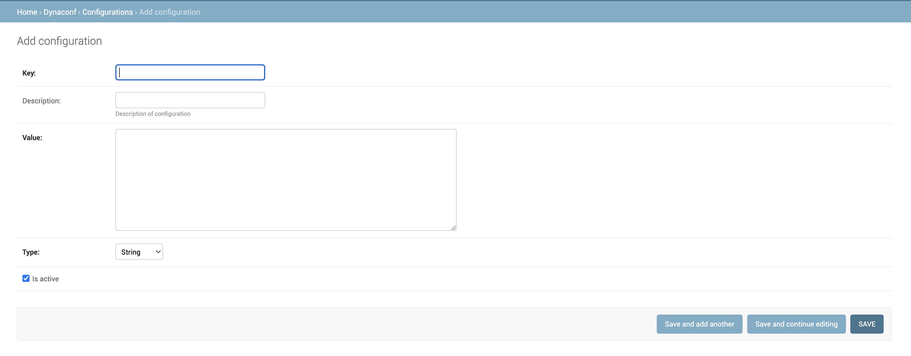

# django-dynaconf

[](https://github.com/mhsiddiqui/django-dynaconf/actions/workflows/test.yml) [](https://codecov.io/gh/mhsiddiqui/django-dynaconf)


Django-dynaconf provides dynamic configuration for your Django project which you can control from Django admin. You can change your configurations at any time without any deployment.

**Note**: You cannot add settings required for Django to operate in this like *INSTALLED_APPS*

# Requirements
* Python > 3
* Django > 1.10

# Setup

1. Run below command to install.

> pip install django-dynaconf

2. Add `django_dynaconf` in your INSTALLED_APPS.
3. Run migration by running following command

> python manage.py migrate

# Usage
_____
Just go to your admin dashboard, in the Dynaconf section, add configurations. 

## Listing


## Form


## Config Type

It supports the following types of configurations. You need to set the correct type for your value otherwise value will be treated as string value and will not be processed into actual data type.
* String
* Number
* Boolean
* Json
* Date
* Datetime
* Time

### String

By default every value will be string.   

### Number

Number includes integers as well as decimal numbers. 

### Boolean

For boolean value, see below chart.

| True | False |
|:----:|:-----:|
|   t  |   f   |
|   T  |   F   |
|   y  |   n   |
|   Y  |   N   |
|  yes |   no  |
|  YES |   NO  |
| true | false |
| True | False |
| TRUE | FALSE |
|  on  |  off  |
|  On  |  Off  |
|  ON  |  OFF  |
|   1  |   0   |

### Json
A valid json is required when the config type is selected as Json.

### Date
Date should be in `YYYY-MM-DD` format. It will be converted to `datetime.date` object.

### Datetime
Datetime should be in `YYYY-MM-DD HH:MM:SS` format and it will be converted to `datetime` object.

### Time
Time should be in `HH:MM:SS` format and it will be converted to `datetime.time` object.

## Usage in code
In your code, you can use it like this.

```python
from django_dynaconf.configs import configs

print(configs.KEY_OF_YOUR_CONFIGURATION)
```

At any time, when you will change your config value or add a new value, it will be available to use in you code.

## Grouping

You can group configurations. Configurations of a particular group can be accessed like this.

```python
from django_dynaconf.configs import configs

print(configs.grouped(group='NAME_OF_GROUP'))
```

## Default value

It is quite possible when you are using a configuration in your code and you have not added that configuration yet. In this case it is best to define a default value of that configuration in your settings so that that default value will be used instead of an error. To define default value of your configurations, define `DYNACONF_DEFAULTS` in settings like this

```python
DYNACONF_DEFAULTS = {
    "KEY_1": True,
    "KEY_2": 2000
}
```
When this key will be added, that value will be used instead of this default value.